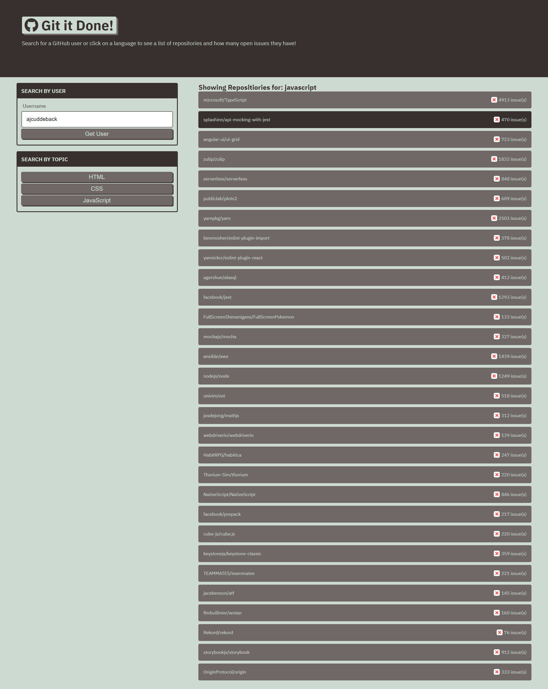

# Git It Done

## Table of Contents:

- [Overview](#overview)
- [Purpose](#purpose)
- [Features](#features)
- [Website](#website)

## Overview

Git it done is a application that will allow you to search open source issues according to different endpoints such as HTML, CSS, or JS issue. This application uses GitHub's API in order to search for popular issues in open source projects.

## Purpose

- This application will allow the user to search for a specific github account or for specific issues according to a coding language.

## Features

- HTML
- CSS
- JavaScript
- GitHub API

## Website

[Deployed Git It Done](https://ajcuddeback.github.io/git-it-done)

